## Projeto 2 Camada Física - 2017.2

Sabrina S.
Paulo Tozzo

## Projeto 2.3

## Modulação

A modulação da amplitude consiste em multiplicar o sinal por uma portadora que tem sua amplitude varialvel usando a formula:
c(t) = Ac*cos(2π*fc*t) a mudulação permite enviar mais de um sinal na mesma onda.

A demodulação consiste em multplicar o sinal recebido pela portadora novamente para desconstruí-lo e achar os sinais originais.

## Portadoras utilizadas

Utilizamos uma frequencia de corte de 3000hz assim a frequencia das portadoras tem que ser maior que o corte, porem ela não pode ultrapasar 22050hz pos nossa frequencia de amostragem é de 44100 e ainda mais as frequencias das portadoras não podem ser proximas se não elas não seram recuperadas, assim foi escolhido as freqncias 7000hz e 1400hz que segue todos esses requisitos.

## Bandas ocupadas

A banda ocupada terá uma frequencia maxima de 22050hz pois o som que tem uma frequencia de 44100hz será dividido em dois para poder ser recuperado

## Graficos da transmição
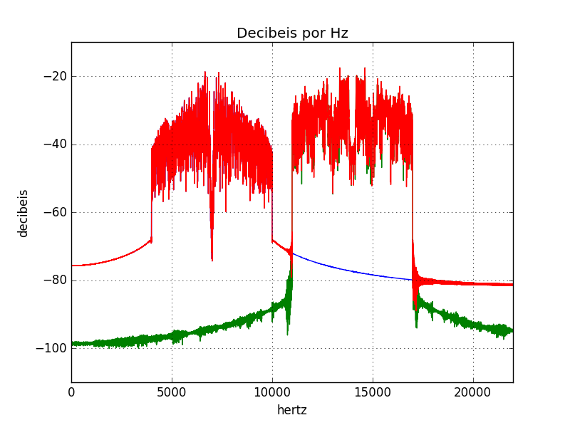

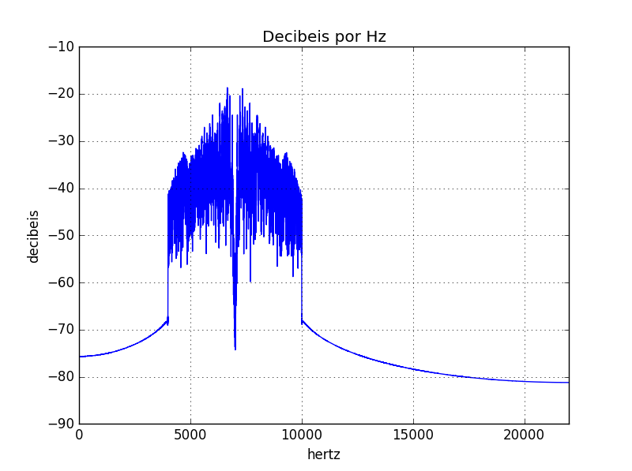

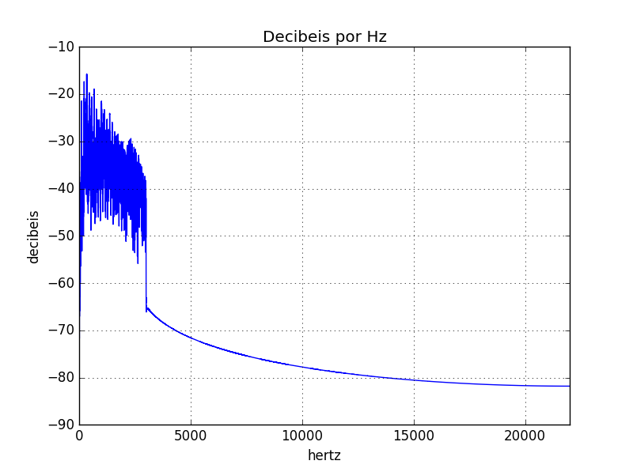

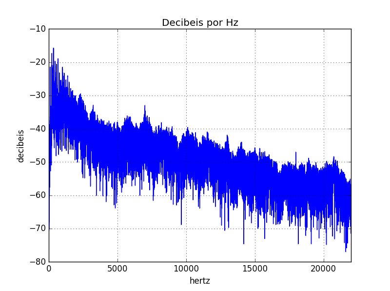

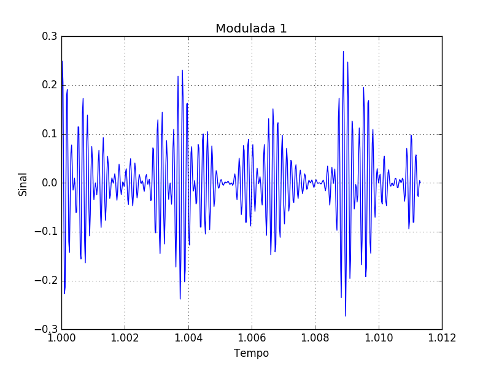

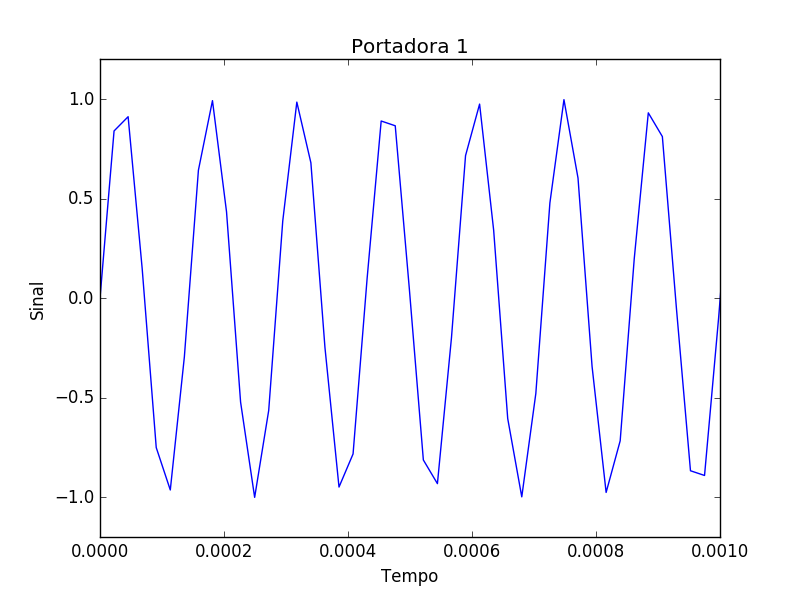

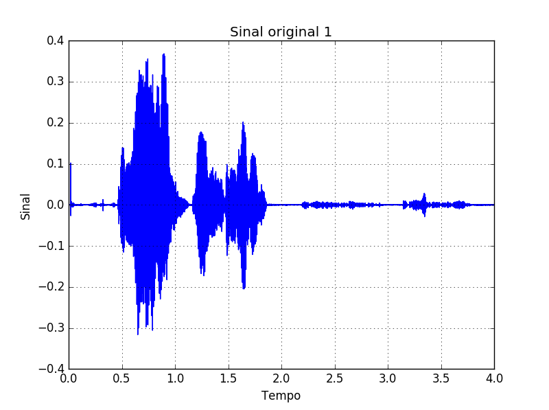

## Graficos da recuperação
som recebido
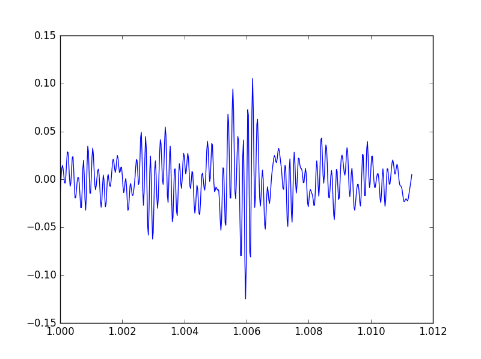

fourier do som demodulado
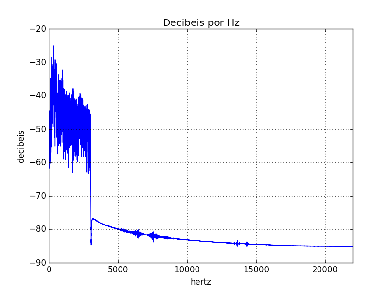

fourier do som recebido
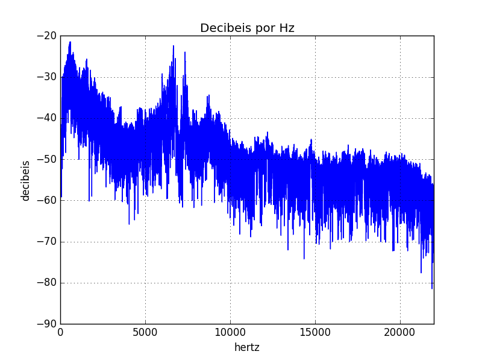

som demodulado no tempo
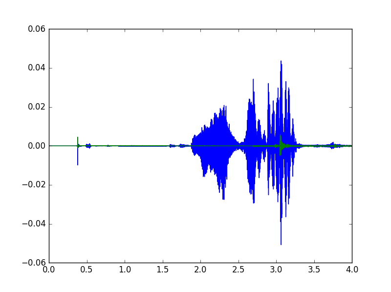

## recuperação
| Sinal Enviado		                 |Sinal Recebido	            |
|--------------------------- ------|----------------------------|
|    |   |
|    |   |

sabrina & paulo
