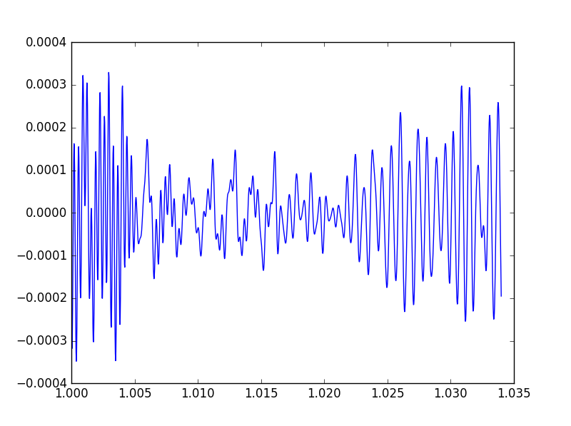
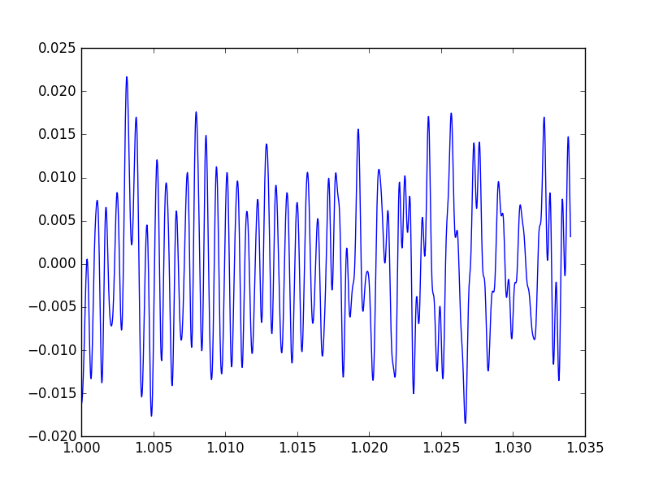

## Projeto 2 Camada Física - 2017.2

Sabrina S.
Paulo Tozzo

## Projeto 2.3

## Modulação

A modulação da amplitude consiste em multiplicar o sinal por uma portadora que tem sua amplitude varialvel usando a formula:
c(t) = Ac*cos(2π*fc*t). A mudulação também permite enviar mais de um sinal na mesma onda.

A demodulação consiste em multiplicar o sinal recebido pela portadora novamente para desconstruí-lo e achar os sinais originais.

## Portadoras utilizadas

Utilizamos uma frequencia de corte de 3000hz, assim a frequencia das portadoras tem que ser maior que o corte, porem ela não pode ultrapasar 22050hz, pois nossa frequencia de amostragem é de 44100. Além disso, as frequencias das portadoras não podem ser proximas, ou não seriam recuperadas, assim foi escolhido as frequencias 7000hz e 14000hz, que seguem todos esses requisitos.

## Bandas ocupadas

A banda ocupada terá uma frequencia maxima de 22050hz, pois o som, que tem uma frequencia de 44100hz, será dividido em dois para poder ser recuperado.

## Graficos da transmição

## Graficos da recuperação
som recebido

fourier do som demodulado

fourier do som recebido

som demodulado no tempo

## recuperação
 Sinal Recebido|Sinal Enviado|
:-------------------------:|:-------------------------:
    |         |
    |          |

sabrina & paulo
